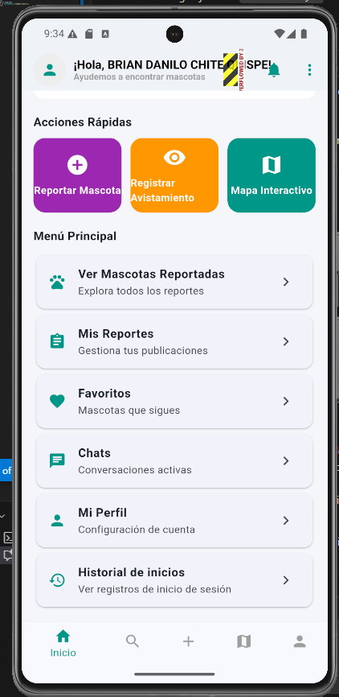
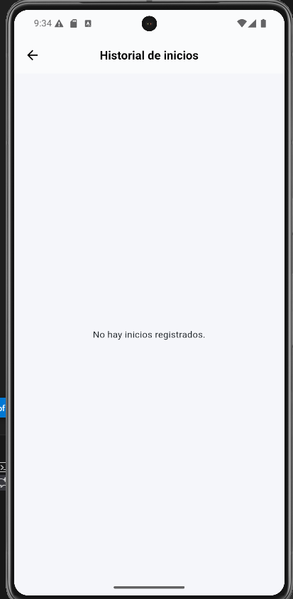
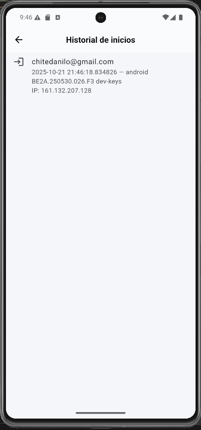

# SM2_EXAMEN_PRACTICO

**Nombre:** Brian Danilo Chite Quispe  
**Curso:** Móviles II  
**Docente:** Oscar Gimenez  
**Fecha:** 21/10/2025  
---

## 📱 Descripción del Proyecto

El proyecto “SOSMascota” es una aplicación móvil creada para ayudar a las personas a reportar, buscar y rescatar mascotas perdidas o que necesiten ayuda. La app conecta a usuarios, veterinarios y administradores para que puedan comunicarse fácilmente y dar una respuesta rápida en casos de emergencia. Permite publicar reportes con fotos, ubicación y descripción**, además de usar un chat interno para coordinar la atención con veterinarios. Está desarrollada con Flutter y Firebase, lo que la hace rápida, segura y fácil de usar.

---

## 🧩 Historias de Caso de Uso
Historia de Usuario
Como usuario autenticado,
quiero ver un historial de mis inicios de sesión,
para saber cuándo y desde qué dispositivo accedí a mi cuenta.

Criterios de Aceptación
•	Al iniciar sesión exitosamente, se registra el usuario, la fecha y hora del inicio, así como la dirección IP desde donde inició sesión.
•	En la sección "Historial de inicios de sesión", el usuario puede ver una lista con:
o	Usuario, la Fecha y hora de inicio de sesión
•	Los registros se deben mostrar ordenados del más reciente al más antiguo.

---

## 📸 Capturas de la Aplicación
descripción breve de las funcionalidades implementadas (historia)

Ejemplo:

**Repositorio GitHub:**  
URL: https://github.com/Danilo314/SM2_EXAMEN_PRACTICO

